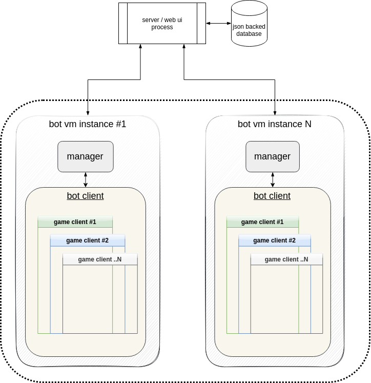

# iBot Farm
> Some Polish guy named Marcin made this
- http://szczawicznecrew.pl
- http://goldfarm.szczawicznecrew.pl
## details
can't say much regarding how he lost his farm but he definitely contributed a lot of his GP to me over the years.
in fact i can recall being on his server watching him as he installed nanny-cam software to figure out where his GP was going.
(i suppose he wanted to see how the GP was being muled off his accounts? ..well buddy, i was one step ahead of you)

there are a few moving parts:
- server/web ui
- manager
- client

## server/web ui
basic spring boot app. is responsible for managing client-updates, accounts, proxies, etc.
this ideally should be ran alone on a small server/container.

the front isn't as feature rich as i'd expect for a farm of this size.
i hope an enterprising fella revamps this portion of the project.

## manager
this application is the communications link between the server and available bot clients on a single server/container.
in other words this app will only manage the clients connected to it and since it only accepts local connections it means it was likely designed to be used to govern local bot-client instances - not remote instances.

## client
a lot could be said for this botting framework. it appears as if a portion of this code was stolen from another source although i can't confirm.
can't dive too much into this as the code structure is a bit scattered and would take a while to re-learn.
what do i remember is the UI for the gamepack is a little interesting in terms of manually loading scripts, etc.
once you get it stood up you'll see what i'm talking about.

## setup and configuration
for whatever this farm was hard coded with paths, domains, usernames, passwords, etc, so getting it up and running was a real task.  :(
so this means that you'll need some starting config files and all that stuff which i'll be supplying.
outside of that you're on your own.

from a UML point of view here is a high level diagram of a possible layout, connections, blah blah..

most of your interactions with this bot farm will be through the server/web-iu.
there wasn't sufficient logging in this app so debugging will suck until you get a bit comfy with it.
